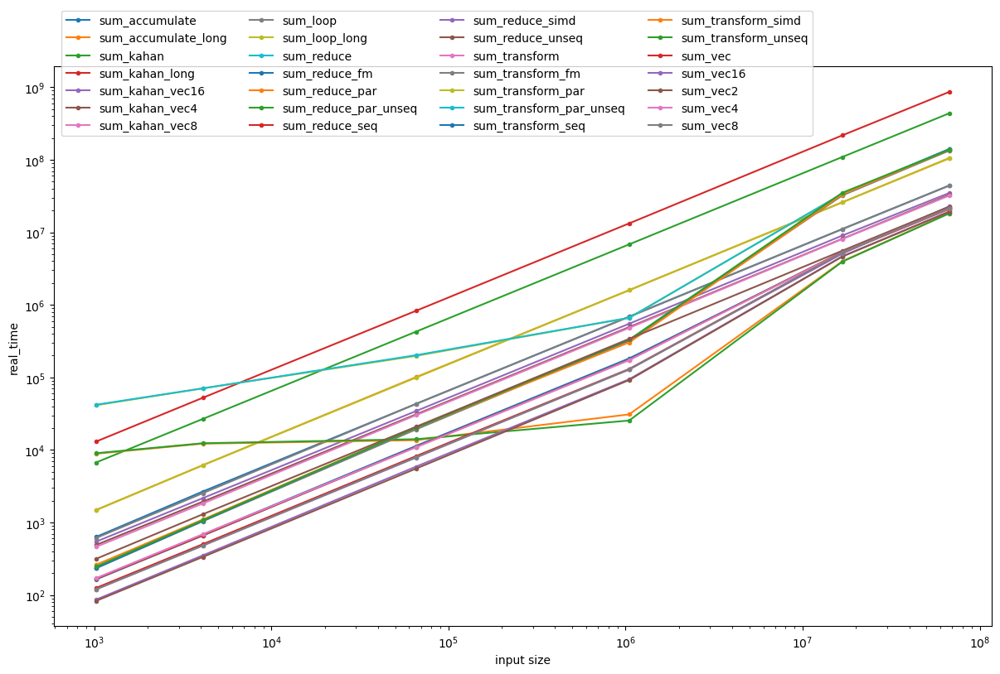

# Summation

This file is best viewed in [CLion](https://www.jetbrains.com/clion/).

The project demonstrates:

* Typical structure of C++ project using CMake with some scripting.
* Data type sizes and random data generation:
  - [main.cpp](source/main.cpp) `main`
* Customized output operations:
  - header [output.hpp](include/sum/output.hpp)
  - implementation [output.cpp](source/output.cpp)
* Unit tests:
  - Custom output: [output_test.cpp](tests/output_test.cpp) `output_test`
  - Summation: [sum_test.cpp](tests/sum_test.cpp) (common to all implementations, uses linking to bind to concrete implementation below)
* Various implementations of the arithmetic sum:
  - [Simple plain loop](source/sum_loop.cpp) `sum_loop_test`
    - [Loop with quadruple precision](source/sum_loop_long.cpp) `sum_loop_long_test`
  - [Vectorized loop](source/sum_vec.cpp) `sum_vec_test`
    - [Vectorized by 2](source/sum_vec2.cpp) `sum_vec2_test`
    - [Vectorized by 4](source/sum_vec4.cpp) `sum_vec4_test`
    - [Vectorized by 8](source/sum_vec8.cpp) `sum_vec8_test`
    - [Vectorized by 16](source/sum_vec16.cpp) `sum_vec16_test`
  - [Kahan's precision summation](source/sum_kahan.cpp)  `sum_kahan_test`
    - [Quadruple precision](source/sum_kahan_long.cpp) `sum_kahan_long_test`
    - [Vectorized by 4](source/sum_kahan_vec4.cpp) `sum_kahan_vec4_test`
    - [Vectorized by 8](source/sum_kahan_vec8.cpp) `sum_kahan_vec8_test`
    - [Vectorized by 16](source/sum_kahan_vec16.cpp) `sum_kahan_vec16_test`
  - [Numeric accumulate](source/sum_accumulate.cpp) `sum_accumulate_test`
    - [Numeric accumulate with quadruple precision](source/sum_accumulate_long.cpp) `sum_accumulate_long_test`
  - [Numeric reduce](source/sum_reduce.cpp) `sum_reduce_test`
    - [Sequenced](source/sum_reduce_seq.cpp) `sum_reduce_seq_test`
    - [Vectorized](source/sum_reduce_unseq.cpp) `sum_reduce_unseq_test`
    - [Parallel](source/sum_reduce_par.cpp) `sum_reduce_par_test`
    - [Parallel vectorized](source/sum_reduce_par_unseq.cpp) `sum_reduce_par_unseq_test`
    - [SIMD](source/sum_reduce_simd.cpp) `sum_reduce_simd_test`
  - [Algorithm transform](source/sum_transform.cpp) `sum_transform_test`
    - [Sequenced](source/sum_transform_seq.cpp) `sum_transform_seq_test`
    - [Vectorized](source/sum_transform_unseq.cpp)  `sum_transform_unseq_test`
    - [Parallel](source/sum_transform_par.cpp) `sum_transform_par_test`
    - [Parallel vectorized](source/sum_transform_par_unseq.cpp) `sum_transform_unseq_test`
    - [SIMD](source/sum_transform_simd.cpp) `sum_transform_simd_test`
* Benchmarking
  - [sum_bm.cpp](tests/sum_bm.cpp) (common for all, uses preprocessor macro for naming)

Example benchmark plot:



Overview of the project in slides: [overview.pdf](overview.pdf)

## Exercise

1. Compile and run all at once by executing **Release** build of `All CTest`:
   - All unit tests
   - All benchmarks (may take a few minutes)
2. Check if all tests have passed
   - If some test failed, find out why (no need to fix)
3. Inspect benchmark results using the following command:
   ```shell
   python3 ./tests/plot.py --logx --logy cmake-build-release/tests/*.json
   ```
   ```shell
   python3 ./tests/plot.py cmake-build-release/tests/*.json
   ```
   - **Left-click** the legend to hide/unhide particular data.
   - **Right-click** the legend to invert the visibility of all data.
   - **Right-double-click** the legend to hide all data.
4. Compare the ***code*** (which is correct? easiest to understand? write? maintain?) and the ***performance*** (which is the fastest?) of:
   - sequential implementations:
     - [sum_loop.cpp](source/sum_loop.cpp) `sum_loop_test` `sum_loop_bm`
     - [sum_loop_long.cpp](source/sum_loop_long.cpp) `sum_loop_long_test` `sum_loop_long_bm`
     - [sum_kahan.cpp](source/sum_kahan.cpp)`sum_kahan_test` `sum_kahan_bm`
     - [sum_kahan_long.cpp](source/sum_kahan_long.cpp) `sum_kahan_long_test` `sum_kahan_long_bm`
     - [sum_accumulate.cpp](source/sum_loop.cpp) `sum_accumulate_test` `sum_accumulate_bm`
     - [sum_accumulate_long.cpp](source/sum_loop.cpp) `sum_accumulate_long_test` `sum_accumulate_long_bm`
     - [sum_reduce.cpp](source/sum_reduce.cpp) `sum_reduce_test` `sum_reduce_bm`
     - [sum_reduce_seq.cpp](source/sum_reduce_seq.cpp) `sum_reduce_seq_test` `sum_reduce_seq_bm`
     - [sum_transform.cpp](source/sum_transform.cpp)  `sum_transform_test` `sum_transform_bm`
     - [sum_transform_seq.cpp](source/sum_transform_seq.cpp) `sum_transform_seq_test` `sum_transform_seq_bm`
   - vectorized implementations:
     - [sum_vec.cpp](source/sum_vec.cpp) `sum_vec_test` `sum_vec_bm`
     - [sum_vec4.cpp](source/sum_vec4.cpp) `sum_vec4_test` `sum_vec4_bm`
     - [sum_vec8.cpp](source/sum_vec8.cpp) `sum_vec8_test` `sum_vec8_bm`
     - [sum_vec16.cpp](source/sum_vec16.cpp) `sum_vec16_test` `sum_vec16_bm`
     - [sum_kahan_vec4.cpp](source/sum_kahan_vec4.cpp) `sum_kahan_vec4_test` `sum_kahan_vec4_bm`
     - [sum_kahan_vec8.cpp](source/sum_kahan_vec8.cpp) `sum_kahan_vec8_test` `sum_kahan_vec8_bm`
     - [sum_kahan_vec16.cpp](source/sum_kahan_vec16.cpp) `sum_kahan_vec16_test` `sum_kahan_vec16_bm`
     - [sum_reduce_unseq.cpp](source/sum_reduce_unseq.cpp) `sum_reduce_unseq_test` `sum_reduce_unseq_bm`
     - [sum_reduce_simd.cpp](source/sum_reduce_simd.cpp) `sum_reduce_simd_test` `sum_reduce_sind_bm`
     - [sum_transform_unseq.cpp](source/sum_transform_unseq.cpp) `sum_transform_unseq_test` `sum_transform_unseq_bm`
     - [sum_transform_simd.cpp](source/sum_transform_simd.cpp) `sum_transform_simd_test` `sum_transform_simd_bm` 
   - parallelized implementations:
     - [sum_reduce_par.cpp](source/sum_reduce_par.cpp) `sum_reduce_par_test` `sum_reduce_par_bm`
     - [sum_reduce_par_unseq.cpp](source/sum_reduce_par_unseq.cpp) `sum_reduce_par_unseq_test` `sum_reduce_par_unseq_bm`
     - [sum_transform_par.cpp](source/sum_transform_par.cpp) `sum_transform_par_test` `sum_transform_par_bm`
     - [sum_transform_par_unseq.cpp](source/sum_transform_par_unseq.cpp) `sum_transform_par_unseq_test` `sum_transform_par_unseq_bm`
